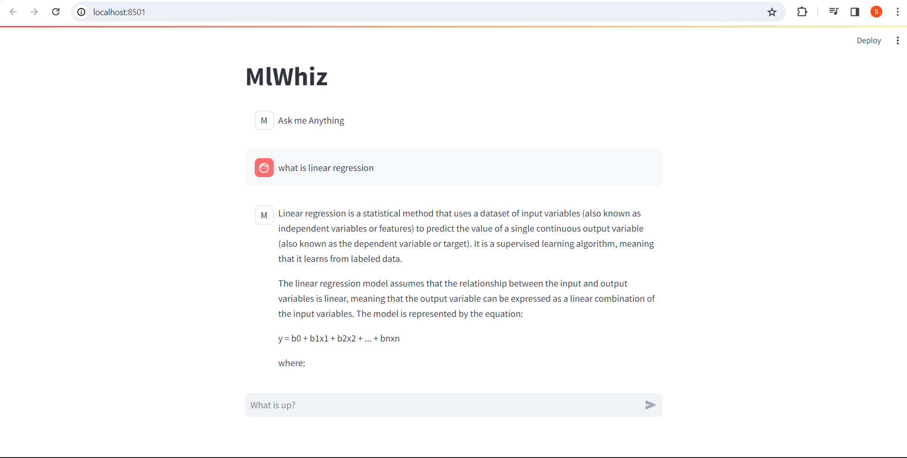
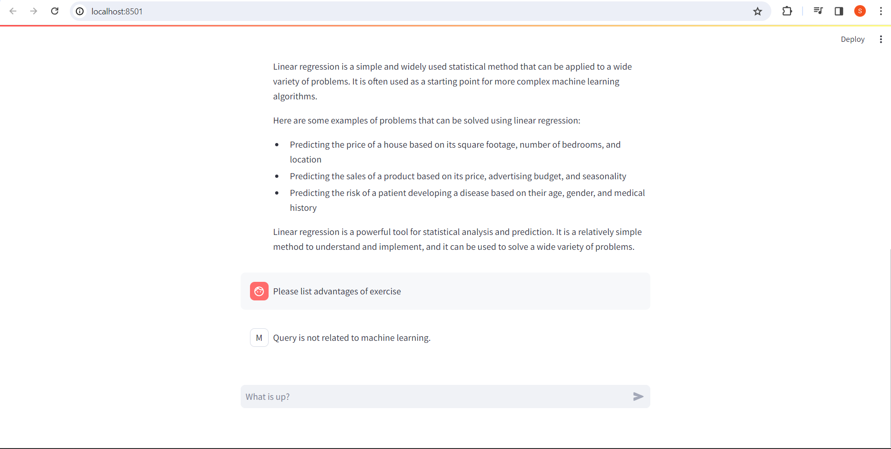

# MLWhiz

MLWhiz is a chatbot designed to assist users with machine learning-related queries. It leverages the Google Generative AI (Gemini) API and is built using the Streamlit framework for the user interface.

## Features

- Interactive Chat Interface: Users can ask machine learning-related questions in natural language.

- Google Generative AI Integration: MLWhiz uses the Google Generative AI (Gemini) API to generate responses to user queries.

- Query Analysis: MLWhiz performs analysis to determine if a given query is related to machine learning concepts.

## Installation

* Ensure you have Python installed. You can install Python by visiting python.org. 


#### Clone the Repository:

```bash
  git clone https://github.com/Shreyasb1015/MLWhiz
  cd MLWhiz
```

* Insert your google gemini pro api key in the main.py file.


* Run this command to execute MLWhiz
```bash
   streamlit run main.py
```


## Implementation Examples





## Contributions

MlWhiz is a solo project, and your contributions are highly welcomed! Whether you have suggestions, bug reports, or feature requests, your input is valuable in enhancing the project. Feel free to contribute.


